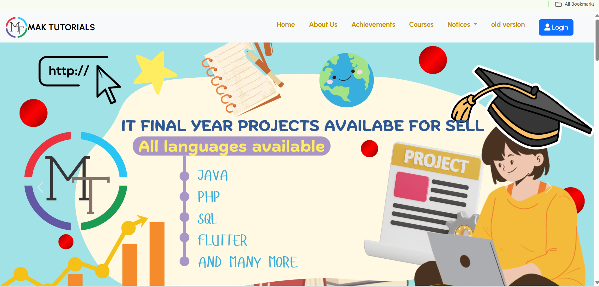
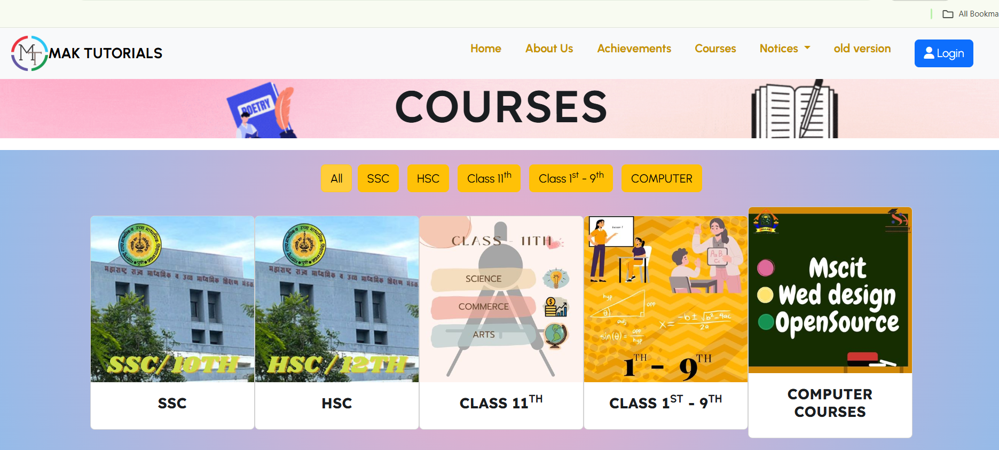
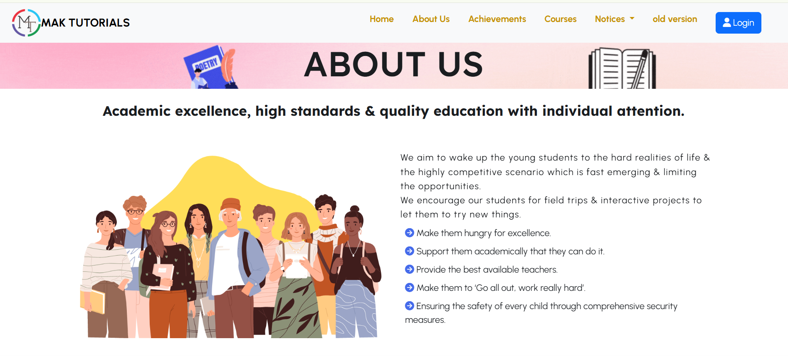
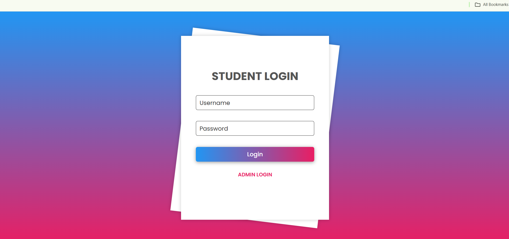
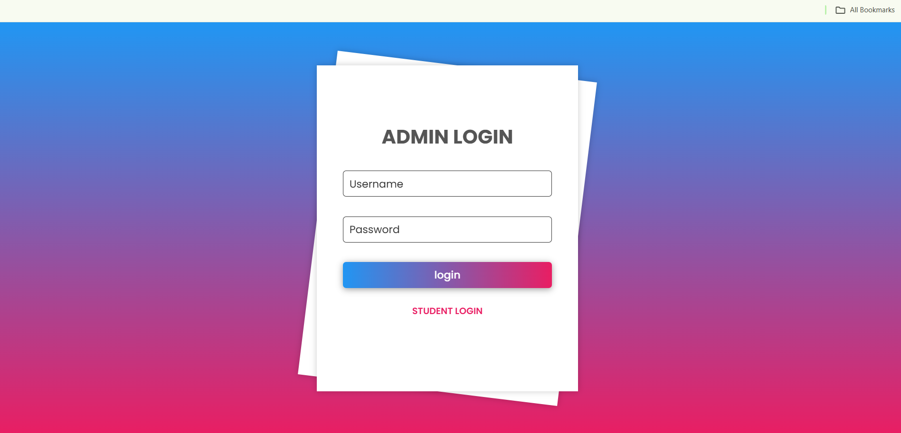
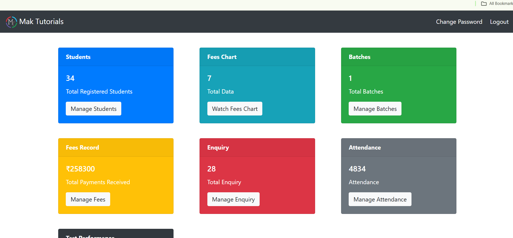
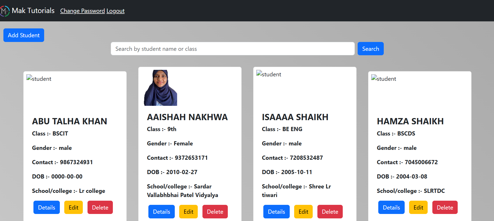

# 📚 MakTutorials

MakTutorials is a PHP-based web application built with Laravel.  
It includes modules for student authentication, fee records, attendance, and batch management.

---

## 🚀 Features

- Student and Admin Authentication  
- Dashboard for Students and Admin  
- Fee Records Management  
- Attendance Tracking  
- Batch Assignment System  

---

## 📸 Screenshots

### 🏠 Home Page

  
  
  
  


### 📊 Admin Dashboard

  


### 🌐 Sample Test Image


---

## ⚙️ Requirements

- PHP >= 8.0  
- Laravel >= 9  
- MySQL  
- Composer  

---

## 🛠️ Setup Instructions

```bash
git clone https://github.com/yourusername/MakTutorials.git
cd MakTutorials
composer install
cp .env.example .env
php artisan key:generate
php artisan migrate
